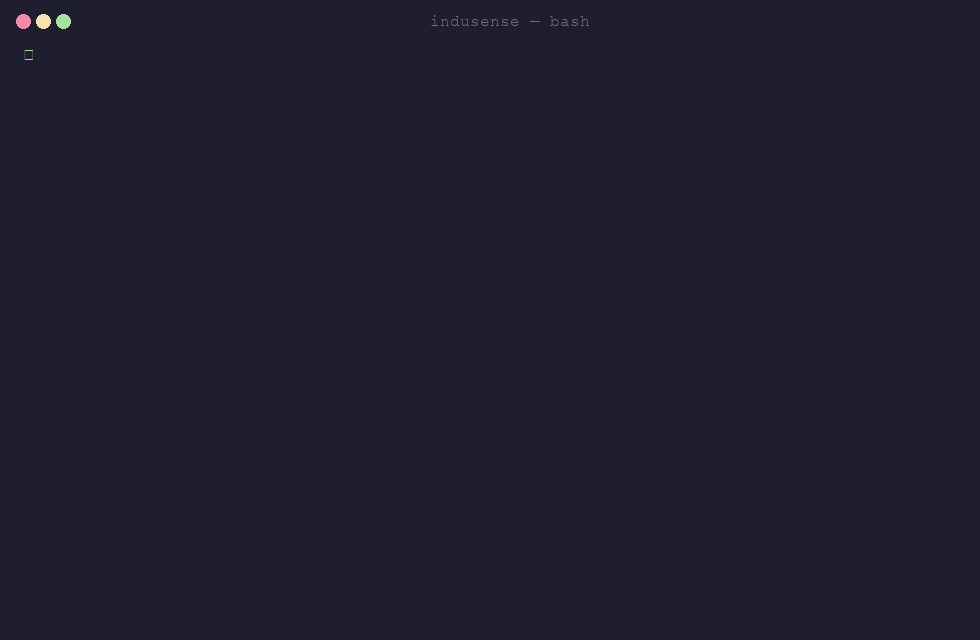

# InduSense — Industrial IoT Monitoring Platform

InduSense is a production-grade, event-driven monitoring platform for a
(fictional) German manufacturing company operating multiple factories. It
ingests real-time telemetry from thousands of machine sensors, detects
abnormal behavior, raises alerts, and manages incidents — end to end,
through real MQTT, Kafka, PostgreSQL, and InfluxDB, not mocked stand-ins.

**Dashboard, live** — logging in, watching real-time alerts, drilling into an
incident's audit trail, and a machine's telemetry chart with real InfluxDB
data:


**Terminal, real output** — `docker compose ps`, a live health check, a real
login, and the full test suite running against the actual stack (no output
faked or trimmed beyond truncating the JWT for readability):



## Why this project exists

This is a portfolio project built to demonstrate real competence in
distributed systems, event-driven architecture, and applied backend
engineering. It prioritizes:

- **correctness over feature count**
- **working integrations over buzzwords**
- **measured performance over invented benchmarks**

Nothing here is faked. If a capability isn't implemented or a number hasn't
been measured, it's marked `NOT IMPLEMENTED` or `NOT YET MEASURED` rather
than claimed.

## Architecture

```text
Sensor Simulator (1000+ sensors)
        │ MQTT
        ▼
Eclipse Mosquitto
        │
        ▼
Ingestion Service (MQTT → Kafka)
        │
        ▼
Apache Kafka  ── telemetry.raw / telemetry.processed / anomalies.detected /
                 alerts / incidents / device.events / audit.events / dead-letter
        │
   ┌────┼─────────────┐
   ▼    ▼             ▼
Stream  Anomaly     Alert
Proc.   Detection   Service
   │       │           │
   ▼       ▼           ▼
InfluxDB  Kafka   Notifications
             │
             ▼
        PostgreSQL
             │
             ▼
        FastAPI REST/WebSocket API
             │
             ▼
        Next.js Dashboard
```

## Tech stack

**Backend — Python**, one service per container: FastAPI (`api`), and four
Kafka-consuming workers (`ingestion`, `stream-processor`,
`anomaly-detector`, `alert-service`) sharing a small `shared/` package
(event schemas, circuit breaker/retry, logging, auth, incidents, audit).
paho-mqtt, confluent-kafka-python, psycopg3, redis-py, influxdb-client,
PyJWT + bcrypt, prometheus_client, OpenTelemetry.

**Infrastructure**: PostgreSQL, InfluxDB, Redis, Apache Kafka, Eclipse
Mosquitto — Docker Compose for local dev, Kubernetes + Helm for cluster
deployment. Prometheus + Grafana + Jaeger for observability.

**Frontend**: Next.js 16 (React 19), TypeScript, Tailwind CSS, Recharts.

**Testing/CI**: pytest (unit/contract/integration/e2e against real infra,
not mocks), GitHub Actions, pip-audit, Dependabot, k6 load tests.

The backend was originally written in Go and later rewritten entirely to
Python, service by service, so the project's owner could personally read,
defend, and maintain every line — see
[docs/phases/17-python-rewrite.md](docs/phases/17-python-rewrite.md).

## How it was built

The system was built incrementally, one phase at a time, each verified
live against real infrastructure before the next began. The detailed
write-up for every phase — architecture decisions, live verification, real
bugs found and fixed, measured numbers — lives in
**[docs/phases/](docs/phases/README.md)**:

1. [Foundation](docs/phases/01-foundation.md) · 2. [Domain](docs/phases/02-domain.md) ·
3. [Sensor Simulation](docs/phases/03-sensor-simulation.md) · 4. [Ingestion](docs/phases/04-ingestion.md) ·
5. [Streaming](docs/phases/05-streaming.md) · 6. [Anomaly Detection](docs/phases/06-anomaly-detection.md) ·
7. [Alerting](docs/phases/07-alerting.md) · 8. [Incidents](docs/phases/08-incidents.md) ·
9. [Authentication](docs/phases/09-authentication.md) · 10. [APIs](docs/phases/10-apis.md) ·
11. [Dashboard](docs/phases/11-dashboard.md) · 12. [Observability](docs/phases/12-observability.md) ·
13. [Testing](docs/phases/13-testing.md) · 14. [Kubernetes + Helm](docs/phases/14-kubernetes-helm.md) ·
15. [Load Testing](docs/phases/15-load-testing.md) · 16. [CI/CD](docs/phases/16-cicd.md) ·
17. [Python rewrite](docs/phases/17-python-rewrite.md)

See also [docs/ANOMALY-DETECTION.md](docs/ANOMALY-DETECTION.md) for the
Isolation Forest design and evaluation writeup.

## Delivery semantics (a note up front)

This system is designed around **at-least-once delivery + idempotent
consumers + deduplication** — not exactly-once semantics across the whole
distributed pipeline. This is a deliberate, documented tradeoff: Redis
SETNX-based dedup in stream-processor, an `idempotency_keys`-backed claim in
anomaly-detector, and alert-service's dedupe-key + cooldown logic. See
[Streaming](docs/phases/05-streaming.md), [Anomaly Detection](docs/phases/06-anomaly-detection.md),
and [Alerting](docs/phases/07-alerting.md) for the details.

## Local setup

```bash
git clone <repo>
cd indusense
make setup   # copies .env.example -> .env
make up      # infra -> migrate -> app services -> frontend, all health-checked
make ps      # check container health
make down    # stop everything (data volumes preserved)
```

Kafka UI: http://localhost:8089 · InfluxDB UI: http://localhost:8086 ·
API: http://localhost:8080 (Swagger docs at `/docs`) ·
Dashboard: http://localhost:3000

Demo users (`make seed`), one per role, password `ChangeMe123!` for all —
**local development only**: `admin@musterfabrik-gmbh.de`,
`factory_manager@musterfabrik-gmbh.de`, `engineer@musterfabrik-gmbh.de`,
`technician@musterfabrik-gmbh.de`, `viewer@musterfabrik-gmbh.de`. A second
organization (`admin@zweite-firma-gmbh.de`, same password) exists
specifically for multi-tenancy testing.

### Alternative: Kubernetes + Helm

Requires a local cluster (Docker Desktop's Kubernetes, minikube, or kind)
and the app images already built locally:

```bash
docker build -t indusense-migrate:latest -f infrastructure/docker/migrate/Dockerfile .
docker build -t indusense-seed:latest -f scripts/seed/Dockerfile .

helm install indusense infrastructure/helm/indusense \
  --create-namespace -n indusense --set seed.enabled=true

kubectl get pods -n indusense
kubectl port-forward -n indusense svc/indusense-api 8080:8080 &
kubectl port-forward -n indusense svc/indusense-frontend 3000:3000 &
```

To generate traffic (has to run as a pod — see
[Kubernetes + Helm](docs/phases/14-kubernetes-helm.md) for why):

```bash
helm upgrade indusense infrastructure/helm/indusense -n indusense \
  --reuse-values --set simulator.enabled=true
```

## Repository structure

```text
indusense/
├── services/          # api, ingestion, stream-processor, anomaly-detector, alert-service (Python)
├── shared/            # event schemas, reliability, logging, tracing, auth, incidents, audit
├── frontend/          # Next.js + TypeScript dashboard
├── simulator/         # sensor simulator
├── infrastructure/    # docker, kubernetes, helm, prometheus, grafana, jaeger configs
├── migrations/        # PostgreSQL schema migrations
├── tests/             # integration, contract, e2e (pytest)
├── load-tests/        # k6 scripts
├── scripts/           # dev/ops scripts
├── docs/              # phase-by-phase write-ups, design docs
├── .github/workflows/ # CI/CD (GitHub Actions)
└── docker-compose.yml
```
